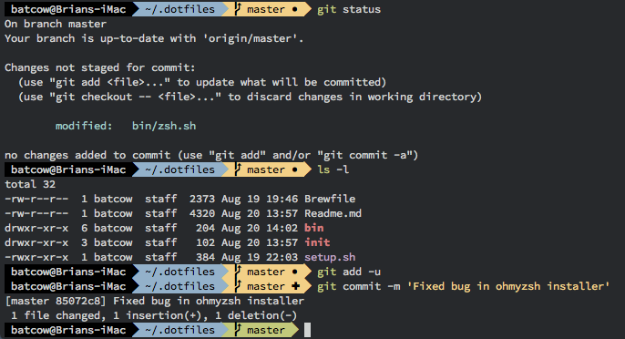

Dotfiles
========

My .dotfiles, configurations and unattended software installs for macOS.




* Installs [RVM](https://rvm.io)
* Installs [Homebrew](https://brew.sh/)
* Installs [Homebrew-Cask](https://caskroom.github.io)
* Installs all software in [Brewfile](Brewfile)
* Sets ZSH to the shell default
* Copies dotfiles to the user $HOME


# Installation

You can clone the repository wherever you want, although `~/.dotfiles` is preferred. The [setup](setup.sh) script will pull in the latest version, install all the software and copy dotfiles to their new $HOME.

```
git clone https://github.com/bcowdery/dotfiles.git ~.dotfiles && ./dotfiles/setup.sh
```

## Staying up to date

You can update your installation at any time by running the setup script again. It will automatically pull the latest sources from git and invoke Homebrew to update software and install new packages from the `Brewfile` formulae.

```
~/.dotfiles/setup.sh
```

## Sensible macOS defaults

When setting up a new Mac, you may want to set up some sensible macOS defaults

```
./.macos
```

# Extras

If any of these files exist, they will be sourced along with the main `~/.zshrc`. These files provide extension points for the shell environment organized by convention.

- `.path` - Additions to the `$PATH`
- `.exports` - Export environment variables, feature detection etc.
- `.aliases` - Aliases for commonly used commands
- `.functions` - Shell functions
- `.extra` - User specific extra's that you generally don't want to commit to github

## Path

Here’s an example `~/.path` file that adds `/usr/local/bin` to the `$PATH`:

```
export PATH="/usr/local/bin:$PATH"
```

## Customizations

You can use `~/.extra` to add a few customizations without the need to fork this entire repository, or to add configuration that you don’t want to commit to a public repository.

For example, you can use `~/.extra` to configure your Git credentials, leaving the committed `.gitconfig` free
of user specific configuration.

```
# Git credentials
# Commented out to prevent people from accidentally committing under my name
#GIT_AUTHOR_NAME="Brian Cowdery"
#GIT_AUTHOR_EMAIL="brian@thebeardeddeveloper.co"
#GIT_COMMITTER_NAME="$GIT_AUTHOR_NAME"
#GIT_COMMITTER_EMAIL="$GIT_AUTHOR_EMAIL"
#git config --global user.name "$GIT_AUTHOR_NAME"
#git config --global user.email "$GIT_AUTHOR_EMAIL"
```

You could also use `~/.extra` to override settings, functions and aliases from my dotfiles repository. Although it's probably better to just [fork this repository](https://github.com/bcowdery/dotfiles/fork) instead.

# Iterm2

## Color Themes

iTerm2 has better color fidelity than the built in Terminal, so your themes will look better.

Get the iTerm color settings

- [Tomorrow-Night](https://github.com/mbadolato/iTerm2-Color-Schemes/raw/master/schemes/Tomorrow%20Night.itermcolors)
- [More themes @ iterm2colorschemes](http://iterm2colorschemes.com/)

Just save it somewhere and open the file(s). The color settings will be imported into iTerm2. Apply them in iTerm through iTerm → preferences → profiles → colors → load presets. You can create a different profile other than `Default` if you wish to do so.

## Install a patched font

My Brewfile installs Source Code Pro and a patched variant that plays nice with powerline consoles. Other fonts can
be installed with the Homebrew-Font's cask or by from the powerline fonts repo. Homebrew is preferred as it will allow
you to script out the install in your `Brewfile`.

- [Homebrew-Fonts](https://github.com/caskroom/homebrew-fonts)
- [Others @ powerline fonts](https://github.com/powerline/fonts)

Set this font in iTerm2 (iTerm → Preferences → Profiles → Text → Change Font).

Restart iTerm2 for all changes to take effect.

# Acknowledgements

Source code and examples were taken from all over the place. Special thanks to:

* [@mathiasbynens](https://github.com/mathiasbynens) (Mathias Bynens)
  [https://github.com/mathiasbynens/dotfiles](https://github.com/mathiasbynens/dotfiles)
* [@mbadolato](https://github.com/mbadolato) (Mark Badolato)
  [iTerm2-Color-Schemes](https://github.com/mbadolato/iTerm2-Color-Schemes)
* [@kevinSuttle](https://github.com/kevinSuttle) (Kevin Suttle)
  [macOS-Defaults](https://github.com/kevinSuttle/macOS-Defaults/blob/master/REFERENCE.md)
